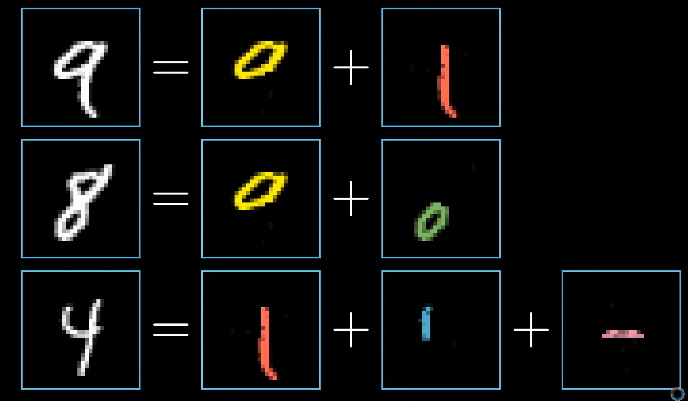
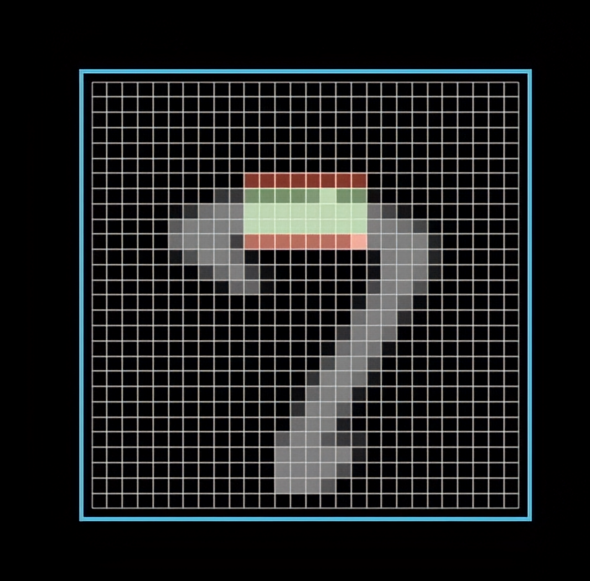
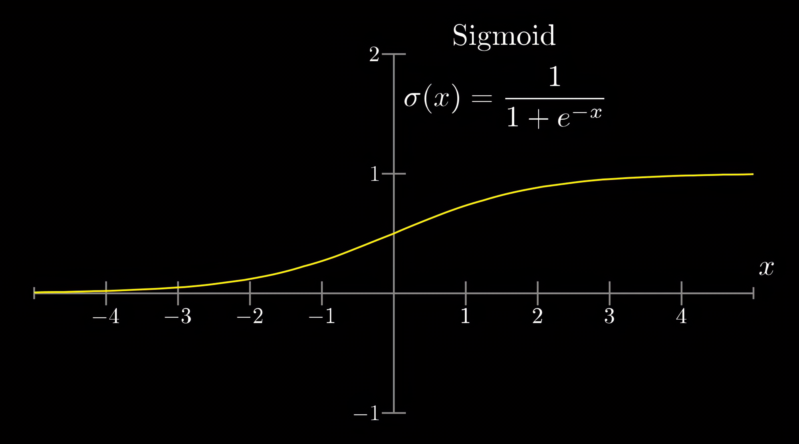
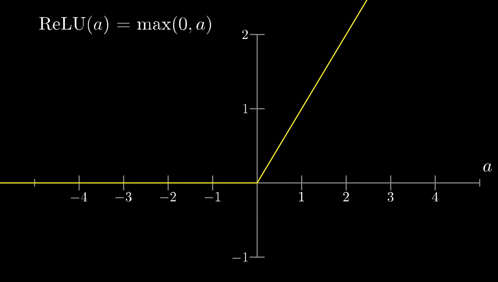
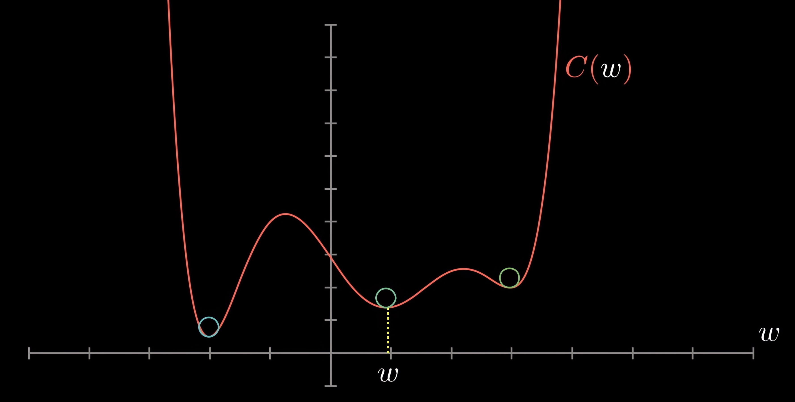
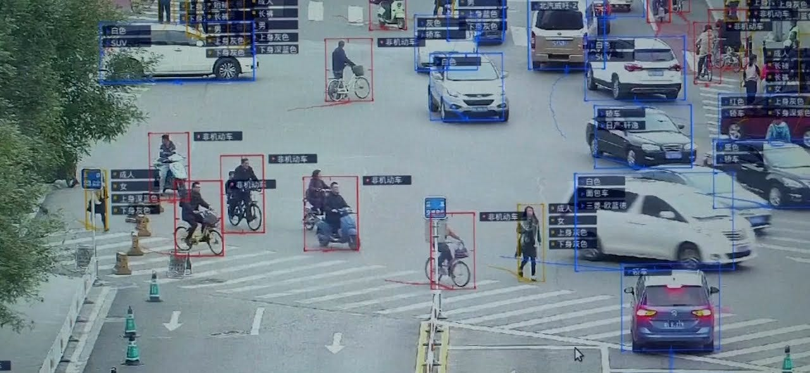
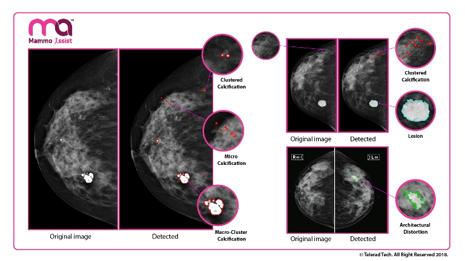
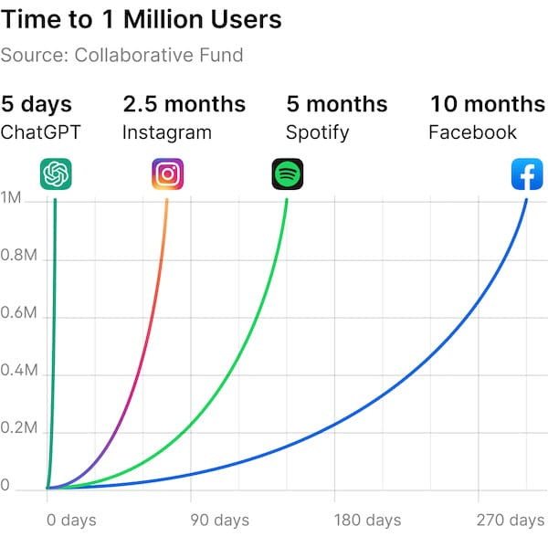
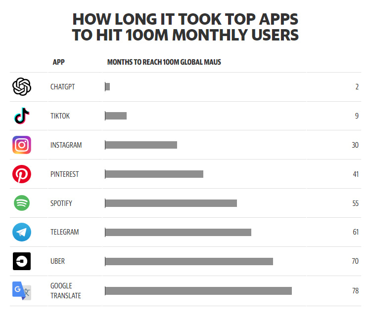
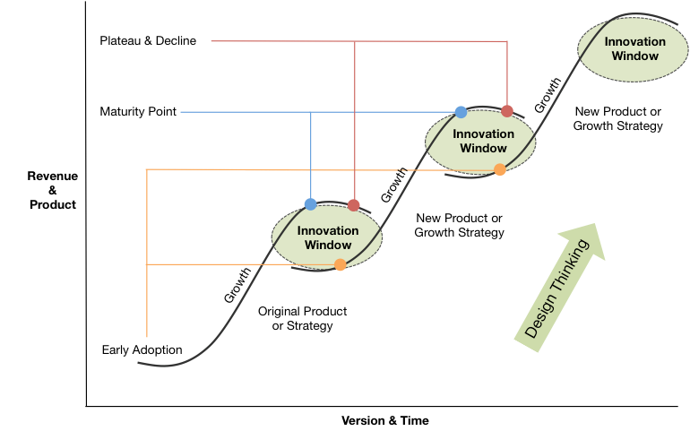

# Table of Contents

# 1. [Introduction](#1.Introduction)
>What is AI?

>Machine learning

>Creating Artificial Intelligence

>	A Neural Network - Deep Learning

# 2. [Examples](#2.Examples)
>AI before 2022

>AI after 2022

>ChatGPT

# 3. [Conclusion](#3.Conclusion)
>Jobs

>AGI 

>State of Development 

# 1. Introduction 

## What is AI?  [1](https://de.wikipedia.org/wiki/K%C3%BCnstliche_Intelligenz) [2](https://www.ibm.com/topics/artificial-intelligence)  [3](https://www.britannica.com/technology/artificial-intelligence)
Artificial Intelligence is the ability of a computer to perform tasks that typically require some sort of intelligence to complete. These systems use algorithms, statistical models, and other techniques to make predictions or decisions about a problem or situation. 

## Machine learning  [1](https://www.tecislava.com/blog/supervised-unsupervised-reinforcement)  [2](https://www.ibm.com/cloud/blog/supervised-vs-unsupervised-learning)  [3](https://jrodthoughts.medium.com/types-of-artificial-intelligence-learning-models-814e46eca30e) [4](https://www.britannica.com/technology/artificial-intelligence/Methods-and-goals-in-AI) [5](https://www.ubuntupit.com/machine-learning-algorithms-for-both-newbies-and-professionals/) [6](https://www.freshconsulting.com/insights/blog/the-different-learning-styles-of-artificial-intelligence/)

### Supervised Learning: 
Supervised learning is a machine learning technique that employs labeled data to train models. Labeled data is data that has been tagged with an outcome or class. For instance, if we were seeking to develop a model to forecast whether or not a client would purchase a product, our labeled data would include client data such as age, gender, location, and the outcome of whether or not they bought the product. Then, supervised learning algorithms employ the tagged data to construct models that can accurately anticipate outcomes based on new input data.

### Unsupervised Learning:  
Unsupervised learning makes inferences from datasets consisting of input data that lacks labeled responses. This type of algorithm is used to cluster data based on similarities, patterns, and differences without any prior model training. Unsupervised learning algorithms include clustering, neural networks, and deep learning.

#### Deep Learning:  
Deep learning is a form of artificial intelligence that employs multiple layers of algorithms and neural networks to perform tasks such as image recognition, speech recognition, and natural language processing. By enabling machines to learn from massive amounts of data, deep learning makes them more accurate and efficient than conventional machine learning algorithms. This type of AI is used in a variety of applications such as self-driving cars, medical diagnosis, and robotics.

### Reinforcement Learning:  
Reinforcement learning is a type of machine learning technique that enables an agent to learn in an interactive environment by trial and error, utilizing feedback from its own actions and experiences. The purpose of reinforcement learning is to find the optimal behavior or path in a given environment to maximize some notion of cumulative reward. It is a machine learning area inspired by behaviorist psychology, which involves taking appropriate actions in an environment to maximize the reward. The agent learns without being explicitly programmed and interacts with its environment to learn the best strategy to take.

### Transfer Learning:  
Transfer learning is a machine learning technique where knowledge acquired while solving one task is transferred to a different but related task. Transfer learning is beneficial when the amount of training data available for the new task is limited, and it can aid in improving the performance of machine learning models. By utilizing knowledge transferred from a related task, it can reduce the amount of training data required and hasten the training process. Transfer learning can also help increase generalization, as the model can learn from more sources than just the task at hand.

## Creating Artificial Intelligence 
### The problem 
The ability to distinguish and recognize objects is an innate characteristic of human beings. For instance, people can effortlessly differentiate between a cat and a dog, even when faced with various breeds of each species. Additionally, humans can read handwritten text and comprehend the meaning behind it, even when the writing style varies drastically. While humans can effortlessly recognize the visual and textual differences between objects, it is significantly more challenging for a computer to do the same.
 
To elaborate, the disparity between a cat and a dog can be attributed to various factors, such as the shape of their faces, the structure of their teeth, the shape of their noses, or the appearance of their eyes. However, teaching a computer to recognize these features is a complex task. Unlike humans, who can instantly recognize a cat as a cat and a dog as a dog, computers require specific programming to differentiate between these two.

### A Neural Network - Deep Learning [1](https://www.youtube.com/watch?v=aircAruvnKk&ab_channel=3Blue1Brown) [2](https://machinelearningmastery.com/rectified-linear-activation-function-for-deep-learning-neural-networks/) [3](https://www.youtube.com/watch?v=IHZwWFHWa-w&ab_channel=3Blue1Brown)
Let’s look at how a computer can recognize handwritten numbers.

#### Neurons
Neural networks are inspired by the human brain.
The “neuron” in this example is just something that holds a number between 0 and 1.

Here we have a 28x28 pixel Image

Every neuron has a value represented by the gray-scale of its pixel.
>Represented by **black = 0** to **white = 1**

The value of a neuron is its "activation," which can be referred to as its level of excitation.

#### Layers
A visualization of a neural network looks something like this: 

The neural network consists of three layers: the **input layer**, which has 784 pixels as input, two **hidden layers**, and the **output layer**. The output layer has one neuron for each digit from 0 to 9. The activation of the neurons in the output layer corresponds to the predicted output of the neural network. Specifically, the activation values represent the predicted probability or confidence that the input image represents a particular digit.

#### Patterns

In the neural network, a pattern is created in the input layer that determines a new pattern in the next layer, and this process continues until the output layer is reached. The output layer contains one neuron whose activation is higher than the activations of the other neurons in the same layer. This neuron is the chosen output of the network, representing the prediction or decision made by the neural network based on the input pattern.

Humans recognize objects and patterns as combinations of smaller pieces. For instance, a face is composed of features such as a nose, mouth, ears, eyes, and eyebrows, which together create the recognizable pattern of a face. However, these individual features can also be broken down into even smaller pieces such as edges and lines. The hidden layers in a neural network aim to capture these hierarchical representations of features in the input data. Each hidden layer is responsible for detecting specific features of the input by combining and processing information from the previous layer. Ultimately, the neural network can recognize complex patterns and objects by analyzing and integrating information across multiple layers of the network.

#### Weights and Biases
But how does a particular neuron in a neural network correspond to a specific feature?
To achieve this, the parameters must have weights.. These weights represent the importance of the connections between neurons. To calculate the output of a neuron, you multiply its weight by its activation value and repeat this process for every neuron in the layer, then sum the results. For example, in an image recognition task, you could assign positive weights to areas where an edge is present and negative weights to the surrounding areas. The final sum calculated by the neuron will be influenced by these marked areas as well as the activation values of the pixels within them. By adjusting the weights of the neurons in the network, the neural network can learn to recognize specific patterns and features in the input data.

##### Sigmoid

Since random numbers are difficult to manage, the calculated results in a neural network are mapped into a range between zero and one. This is typically achieved by using a sigmoid function, where high positive numbers are mapped towards 1 and high negative numbers are mapped towards 0. The sigmoid function ensures that the activations of the neurons are constrained to a certain range, allowing for more effective training and better predictions.

##### ReLU (Rectified Linear Unit)

The Rectified Linear Unit (ReLU) function is a non-linear activation function that outputs the input directly if it is positive, and zero otherwise. ReLU has several advantages over other activation functions, such as simpler computation and a constant derivative for positive inputs, which reduces the time taken for the model to learn and minimizes errors. ReLU is also capable of outputting a true zero value, which can be useful in certain applications. Another advantage is that ReLU has a reduced likelihood of causing the vanishing gradient problem, which can occur when using other activation functions. As a result of these benefits and flaws of  sigmoid, ReLU has become a popular choice for activation functions in neural networks.

To optimize the neural network, a bias is utilized, which is added or subtracted from the sum. The bias enables the activation function to shift so that even if all input pixels have a value of 0 (black image), some neurons in subsequent layers can still be activated. This is important because certain characters may have features that are not dependent solely on pixel values, but also on their relative positions. For instance, consider two letters 'O' and 'Q,' which are very similar except for a small tail at the bottom right corner in 'Q.' If this tail is absent in an image owing to noise or poor handwriting, the network may still correctly identify it as 'Q' based on other characteristics such as its overall shape and size.

During training, the value of bias for each neuron is established along with other weights. As training advances, biases and weights are adjusted so that they converge on values that minimize prediction errors.

Ultimately, "learning" simply entails adjusting the weights and biases to fit the task.

#### Learning
Neural Networks require extensive training on large amounts of data to learn. Labeled data is necessary for this type of learning, which links the input to the correct output. These labeled datasets can be obtained from the internet or created manually, emphasizing the importance of data collection.

At the start of training, the neuron parameters are initialized as random, causing poor network behavior. The output's deviation from the desired output is measured by calculating the difference, which results in the cost. The higher the cost, the greater the punishment for the computer, and the cost's average determines the network's accuracy. To improve accuracy, the minimum value of this function, or the lowest average cost, must be determined.

It is difficult to calculate this value, so the weights and biases are adjusted in the direction that leads to a lower cost until it begins to increase again. This process continues to approach a local minimum. 

# 2. Examples 

One of the best ways to showcase the capabilities of AI is through direct demonstration. The remarkable advancements in AI technology in 2022 have set a clear differentiation between what was possible before 2022 and what is now achievable.

### Pre 2022 AI

#### Computer Vision 
AI ist present in a wide range of fields.
##### Face Recognition
One of the most commonly used applications of AI is facial recognition, which is often used in smartphones such as Apple's Face ID. This technology uses AI algorithms to recognize the unique features of your face and allows you to unlock your phone, while preventing others from doing so.

source: https://ayudaleyprotecciondatos.es/wp-content/uploads/2020/09/Face-ID-00.jpg

##### Object Detection
The same approach of using AI can also be applied to detecting objects, as seen in China's surveillance systems. AI algorithms can analyze live video feeds from cameras and recognize various objects and even behaviors, such as jaywalking or loitering, allowing authorities to quickly respond to potential threats or incidents.

source: https://cdn-images-1.medium.com/max/2400/1*igobxoTP6MeDXs9cxlL5JQ.jpeg

AI is capable of detecting various things, and in some cases, it can even detect things that are difficult for humans to find. For example, AI can be used to detect cancer cells in medical images, which may be too small or too hidden for a human to identify with certainty. This is a valuable tool for improving the accuracy and speed of cancer diagnosis and treatment.

source: https://medicarepharmabusiness.com/wp-content/uploads/2018/10/MammoAssist_20181030.jpg

#### Natural Language Processing (NLP)
Another important application of AI is in the field of Natural Language Processing.

##### Voice Recognition
Voice recognition technology, similar to face recognition, can detect and recognize spoken words. This technology is widely used in popular voice assistants such as Siri, Google Assistant, and Alexa.

#### Other applications of AI 
- Translating Text 
- Predicting stock prices
- Social Media recommendation (TikTok, Youtube, Instagram …)
- Enemies in Video Games 
- Robotics (eg. Boston Dynamics)

### 2022 and later [1](https://openai.com/)
In 2022, there were significant developments in the use of artificial intelligence tools in two major sectors, the first being art. 

#### Stable Diffusion
OpenAI released DALL-E 2 in early 2022, followed by an Open Source Stable Diffusion Model, and Midjourney in the summer of 2022. All of these tools use a technique called "Stable Diffusion," which involves gradually diffusing noise while preserving image features until a stable state is reached, resulting in a clear and sharp image. 

source: [Midjourney Showcase](https://www.midjourney.com/showcase/top/)

The major breakthrough of using Stable Diffusion in creating art is the ability to generate stunning images in just a few minutes. This is a significant improvement compared to previous techniques used to create images from a text prompt. The new process allows for a whole new level of efficiency and speed in producing high-quality art.

#### Large-Language-Models 
In early June, a new coding assistant called "GitHub Copilot" was released. This tool has several advantages, including:
-   [It can help you learn new languages or frameworks by showing you how to use them](https://github.com/features/copilot)[1](https://github.com/features/copilot).
-   [It can help you write boilerplate code that is repetitive and can be simplified](https://proxify.io/articles/what-is-github-copilot)[2](https://proxify.io/articles/what-is-github-copilot).
-   [It can help you focus on more satisfying work and feel more productive](https://github.blog/2022-07-14-research-how-github-copilot-helps-improve-developer-productivity/)[3](https://github.blog/2022-07-14-research-how-github-copilot-helps-improve-developer-productivity/).
-   [It can help you avoid common security vulnerabilities by blocking insecure code suggestions](https://github.blog/2023-02-14-github-copilot-for-business-is-now-available/)[4](https://github.blog/2023-02-14-github-copilot-for-business-is-now-available/).

In simpler terms, GitHub Copilot is a coding assistant that makes it easier for developers to write code by suggesting code as they type. The tool does not require developers to learn a new language or framework; they just need to have a basic understanding of programming. Developers only need to explain what they want to achieve, and the tool writes the code for them.

The major improvement of GitHub Copilot is that it can include the context of the code being written. This means that it can write code that not only works but also fits into the context of the code being written. This is a significant improvement over previous tools that only wrote code that was correct but not necessarily in the right context.

Using GitHub Copilot, developers can write a whole game of tic tac toe or fix issues on their own based on a single prompt. This enables less experienced programmers to write code and solve problems with ease. Overall, GitHub Copilot is a powerful tool that can save developers a significant amount of time and effort while also improving the accuracy and efficiency of their coding process.

### [ChatGPT](https://openai.com/blog/chatgpt)
In November 2022, things got crazy after the release of ChatGPT. Within just five days, the chatbot had already reached one million users. This is an impressive feat, especially compared to other startups.

source: https://wearejunction.com/can-chatgpt-build-your-marketing-plan/

Furthermore, it did not take very long for ChatGPT to reach its first 100 million users after the initial surge.

source: [With 100 Million Users In Just 2 Months, OpenAI's ChatGPT Becomes The Fastest-Growing App In History | Eyerys](https://www.eyerys.com/articles/timeline/openai-chatgpt-with-100-million-users-in-2-months#event-a-href-articles-timeline-microsoft-puts-chatgpt-robot-and-drone-let-it-experience-real-worldmicrosoft-puts-chatgpt-into-a-robot-and-drone-to-let-it-experience-the-real-world-a)

#### Features  & Capabilites 
>“As a language model trained by OpenAI, ChatGPT has been trained to understand and generate human-like language responses. This means that ChatGPT can answer a wide variety of questions on a range of topics, engage in conversations, and even generate creative writing like poetry and short stories.“ [**By ChatGPT**](https://chat.openai.com/chat)

But not only that it can also write Code, sometimes better than github copilot. 
**It can also solve tasks:**

![[IMG_0404.jpeg]]

1.  "Crammed into" means to be packed tightly or overcrowded into a small or limited space. In this case, it refers to a large number of people living in a small area.
    
2.  "Apply this vertical model" means to use the concept of vertical space in the context of urban agriculture. Specifically, it means to grow crops in multi-story buildings instead of traditional horizontal farming methods.
    
3.  "In keeping with" means to be consistent with or to follow a certain philosophy or principle. In this case, it means that Sky Greens' actions and practices are in line with their belief in low-carbon practices.
    
4.  "Have in common" means to share similarities or traits. In this case, it is referring to Scotland, Norway, Vietnam, and Chile sharing the trait of having successful aquaculture industries.
    
5.  "A double whammy" means two good outcomes or results from one action. In this context, scientists are looking for a way to develop a product that not only has positive health benefits but is also profitable.
    
6.  "Money-spinning product" refers to a product that generates a significant amount of revenue or profit.
    
7.  "Unfit for human consumption" means that a type of food is not safe or healthy to eat.
    
8.  "Waste not, want not" is an old saying that means if you use resources wisely and don't waste anything, you will have enough for your needs. In this case, the phrase is being given a new meaning in the context of reducing food waste. 

There are endless possibilities for ChatGPT due to its conversational way of interaction. It can assist in learning new things in a very short time by providing quick and informative responses.

### More AI tools
Following the release of ChatGPT, the internet saw an explosion of new AI technology in various fields.

Some popular are: 
- Music Generation [Riffusion](https://www.riffusion.com/), [Google’s MusicLM](https://google-research.github.io/seanet/musiclm/examples/) 
- Speech Recognition by [OpenAI, nearly perfect transcription with “Whisper”](https://openai.com/research/whisper)
- Text-to-Speech, Perfect voice cloning in few minutes by [Elevenlabs](https://beta.elevenlabs.io/))

And many more like:
- Studio-like sound quality enhancing [Adobe](https://podcast.adobe.com/enhance)
- AI-generated Presentations [Tome - The AI-powered storytelling format](https://beta.tome.app/)
- AI-generated Logos [Looka](https://looka.com/)

Even libraries for these new tools were created:
- [Future Tools - Find The Exact AI Tool For Your Needs](https://www.futuretools.io/)
- [Futurepedia - The Largest AI Tools Directory](https://www.futurepedia.io/)

# 3. Conclusion 

With the success of ChatGPT many companies issued an internal *“code-red”* , like google 
pressing them to release their plans on AI, which where not as good as thought 
The success of ChatGPT prompted many companies, including Google, to issue an internal "code-red," urging them to reveal their plans on AI, which were not as promising as initially thought. This was reported in Forbes [1](https://www.forbes.com/sites/davidphelan/2023/01/23/how-chatgpt-suddenly-became-googles-code-red-prompting-return-of-page-and-brin/) and other sources [2](https://www.msn.com/de-de/nachrichten/digital/kehrtwende-nach-pannen-und-protesten-bard-kommt-doch-nicht-in-die-google-suche/ar-AA18hhgu).

Google was planning to launch its competitor to ChatGPT called "Bard," but it reportedly gave some wrong answers and was not as capable as ChatGPT. Only a few days before Google's showcase, Microsoft released its new ChatGPT integration in their search engine "Bing" [3](https://www.bing.com/new) .and announced an integration in their office program lineup. 

The big improvement of "Bing Chat" is that it is more capable than ChatGPT and in addition has access to the internet, allowing it to summarize websites, conduct research, and perform all the tasks that ChatGPT can do.

What this is showing  is that the AI is getting better and better and that we are entering a new era of AI. The revolution of AI is coming and it will change the world as we know it.

## Jobs [1](https://www.weforum.org/agenda/2018/09/is-artificial-intelligence-replacing-jobs-truth/) [2](https://builtin.com/artificial-intelligence/ai-replacing-jobs-creating-jobs)
It is no surprise that positions previously held by human workers are now being taken over by autonomous technology such as factory robots. These roles are typically those that do not require creativity or cognitive power, and it appears that these are the first to be replaced in recent months.

However, it is worth noting that new jobs are also emerging as a result of AI advancements. One such example is that of a "prompt engineer," a role that demands a strong understanding of language The impact of a well-crafted prompt on systems like ChatGPT or Midjourney is significant, and the ability to create effective prompts and comprehend how these systems function will be a valuable skill in the next phase of the AI revolution.

## AGI [1](https://openai.com/blog/planning-for-agi-and-beyond)
Artificial General Intelligence (AGI) represents the next step in the evolution of AI, possessing computational capabilities far beyond that of human intelligence. However, the unpredictable nature of AGI is a significant challenge, as its actions cannot be foreseen. Its implementation may lead to both positive and negative outcomes, with potential consequences ranging from helping to improve the human condition to causing its downfall.

The key factor in determining the behavior of AGI is the training data. The way that AGI is trained influences the outcome of its decision-making process, which in turn has far-reaching implications. Careful consideration must be given to the sources of training data, and the methodologies used to generate it, to ensure that the AI does not adopt biases or harmful behaviors.

One crucial consideration is the ethical use of AGI. It should not be employed as a weapon, as the consequences of such a deployment could be catastrophic. Instead, the focus should be on developing AGI for the betterment of humanity, while simultaneously taking steps to mitigate the risks associated with its implementation.

In conclusion, while AGI holds significant promise, its implementation must be approached with caution. Careful consideration must be given to the training data, and ethical concerns must be taken into account to ensure that AGI is used to enhance the human experience, rather than being a force for harm.

There are already guidelines by many companies such as openai and microsoft about the responsible and safe use of AI which look like this: 

>1. We want AGI to empower humanity to maximally flourish in the universe. We don’t expect the future to be an unqualified utopia, but we want to maximize the good and minimize the bad, and for AGI to be an amplifier of humanity.
>
>2. We want the benefits of, access to, and governance of AGI to be widely and fairly shared.
>
>3. We want to successfully navigate massive risks. In confronting these risks, we acknowledge that what seems right in theory often plays out more strangely than expected in practice. We believe we have to continuously learn and adapt by deploying less powerful versions of the technology in order to minimize “one shot to get it right” scenarios.

## State of Development [1](https://www.futurebusinesstech.com/blog/the-s-curve-pattern-of-innovation-a-full-analysis) [2](https://www.youtube.com/watch?v=jPhJbKBuNnA&ab_channel=TomScott)

In recent decades, significant technological advancements have followed a distinctive pattern of growth commonly known as the S-Curve of Innovation.

This framework explains the progression of an industry, product, or business model over time in terms of innovation, performance, and financial gain.

The S-Curve Pattern of Innovation begins with a period of slow growth, where innovation is limited, and the industry or product is still in its infancy. As innovation gains momentum and new discoveries are made, the growth rate accelerates, leading to a rapid expansion phase. During this phase, the industry or product gains widespread adoption, and profits skyrocket.

However, as the industry matures and reaches a point of saturation, the growth rate begins to slow down. The market becomes saturated with similar products or services, and innovation becomes more challenging. The industry or product reaches a plateau, and profits begin to level off.

This plateau, however, is not the end of the road for innovation. New technologies and discoveries emerge, and a new S-Curve of Innovation begins, leading to further growth and development.

Understanding the S-Curve Pattern of Innovation can help businesses and industries plan for the future and prepare for potential disruptions. By anticipating when the industry will reach its plateau and planning for the next S-Curve of Innovation, businesses can stay ahead of the competition and remain relevant in an ever-changing market.

The question that naturally arises is where we currently stand on this curve of innovation. If we have already tapped into the majority of its potential, we can expect to see incremental improvements and advancements in the tools and technologies that already exist. These improvements will likely result in greater sophistication and efficiency.

On the other hand, if we are still at the beginning of the curve, we can anticipate exponential growth and progress over the next few years. The potential for advancement and innovation is limitless, and it is difficult to imagine just how transformative the developments will be.

It is essential for individuals and businesses to stay informed about the latest innovations and trends to take full advantage of the opportunities that lie ahead. 

